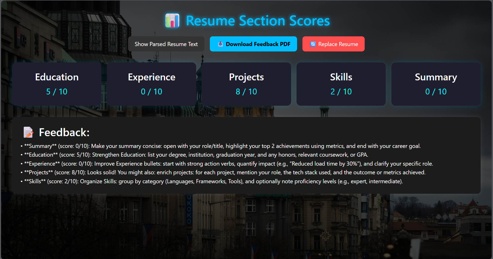

# 🧠 AI Resume Evaluator

An intelligent web application that evaluates resumes using NLP and machine learning. Upload your resume (PDF), and the system will analyze its content, provide scores for key sections (Education, Experience, Skills, etc.), and generate personalized feedback for improvements.

---

## 🚀 Features

- 📄 Upload and parse PDF resumes
- 📊 Section-wise resume scoring (0–10 scale)
- 💬 Smart AI-generated feedback using `flan-t5-base`
- 📥 Download detailed feedback as PDF
- ✨ Animated UI with smooth page transitions (Framer Motion)
- 🔁 "Replace Resume" functionality
- 🔐 Fully local ML processing (no external API dependency)
- 🎨 Beautiful UI using React + TailwindCSS

---

## 📸 Screenshots




---

## 🛠️ Tech Stack

| Frontend         |     Backend      |          ML / NLP           |
|------------------|------------------|-----------------------------|
| React (Vite)     | Flask (Python)   | HuggingFace Transformers    |
| Tailwind CSS     | Flask-CORS       | `flan-t5-base` (Local)      |
| Framer Motion    | PyMuPDF          | Custom resume scoring logic |

---

## 📂 Project Structure

ai-resume-evaluator/
│
├── client/ # React frontend
│ ├── public/
│ └── src/
│ ├── components/ # SplashScreen, ResumeUpload, ResultPage
│ ├── App.js # Main app router & transitions
│ └── index.js
│
├── server/ # Flask backend
│ ├── app.py # API endpoints
│ ├── feedback.py # AI model feedback logic (flan-t5-base)
│ ├── scoring.py # Smart scoring logic (no API)
│ └── parser.py # Resume parsing using PyMuPDF
│
├── screenshots/ # UI previews for README
│ ├── splash.png
│ ├── upload.png
│ └── results.png
│
├── requirements.txt # Python dependencies
└── README.md


---

## 🧪 Local Development

### ✅ Prerequisites

- Python 3.9+  
- Node.js 16+  
- Git  
- pip / virtualenv

### 🔧 Backend (Flask + Transformers)

```bash
cd server
python -m venv venv
venv\Scripts\activate  # or source venv/bin/activate
pip install -r requirements.txt
python app.py

---

##🎯 To-Do / Enhancements
✅ Replace dummy scoring with smart section analysis

✅ Full local model-based feedback (no OpenAI)

⏳ Resume keyword matching vs job descriptions

⏳ Login & resume history

⏳ AI-powered resume builder

⏳ Multilingual support

---

##🤝 Acknowledgements

   Hugging Face Transformers

   Google flan-t5-base

   PyMuPDF

   TailwindCSS

   Framer Motion

---

##📄 License
MIT © 2025 [ADAMYA SINGH]

---

##📬 Contact

#### **Adamya Singh**

* B.Tech CSE @ Jaypee Institute of Information Technology  
* [LinkedIn](https://www.linkedin.com/in/adamya-singh-35598a24a/) | [GitHub](https://github.com/AdamyaSingh7)  
* 📧 [Email](mailto:adamyasingh54@gmail.com)


